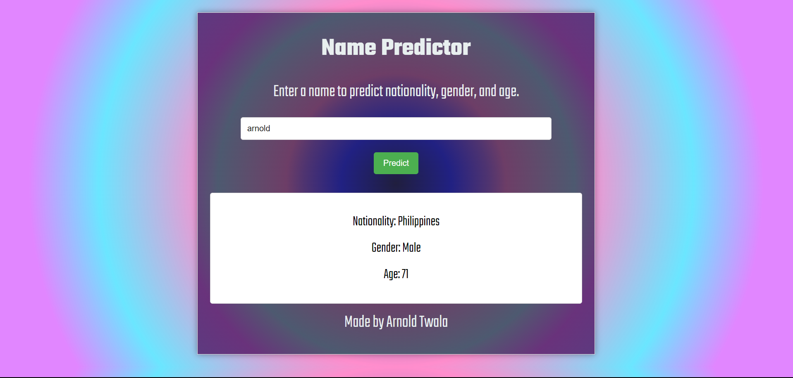

# Name Predictor

Name Predictor is a web application that predicts a user's nationality, gender, and approximate age based on their name. It utilizes several APIs to gather predictions and display them to the user.

 

## Features

- Predict the nationality of the entered name.
- Predict the gender of the entered name.
- Predict the approximate age of the entered name.
- Display fetching status and handle errors gracefully.
- Auto-focus on the input field for a seamless user experience.
- Toast notifications to inform the user about the success or failure of data fetching.

## Installation

1. Clone the repository:
git clone [https://github.com/eagleknite/nationality-predictor]

css
Copy code

2. Navigate to the project directory:
cd name-predictor

markdown
Copy code

3. Install the required dependencies:
npm install

markdown
Copy code

4. Start the application:
npm start

markdown
Copy code

5. The application should now be running on `http://localhost:3000`.

## Usage

1. Enter a name into the input field.
2. Click the "Predict" button.
3. View the predicted nationality, gender, and age.

## Built With

- React.js
- react-toastify for notifications
- Various APIs: nationalize.io, genderize.io, agify.io, and restcountries.com

## Contributing

Pull requests are welcome. For major changes, please open an issue first to discuss what you would like to change.

## License

MIT